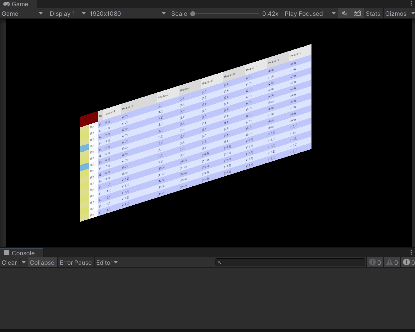
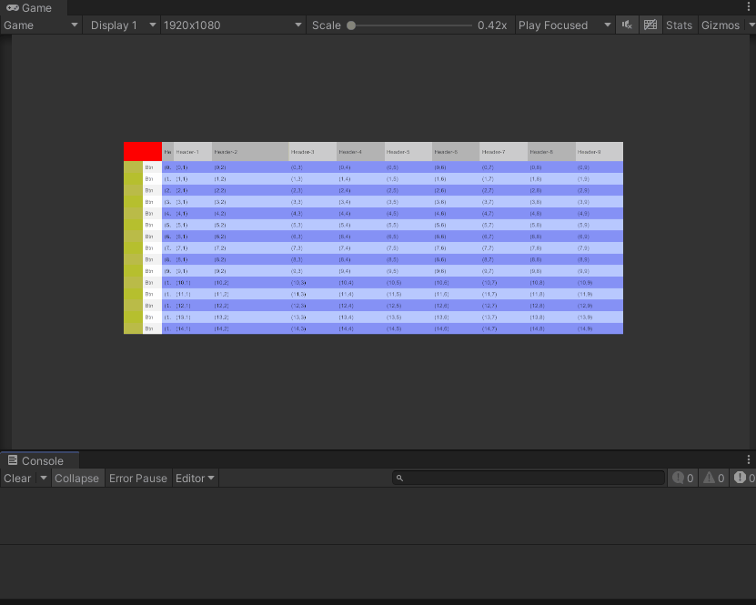

# EasyTableGPU / 易用GPU表格

[](https://unity.com/)

> **基于 GPU 渲染的高性能表格插件 | GPU-Accelerated High-Performance Table Plugin for Unity**

---

## 简介 | Introduction

**EasyTableGPU** 是一个基于 **GPU Mesh 渲染** 的 Unity 高性能表格插件。与传统 UGUI 拼接大量 UI 元素不同，本插件通过**程序化构建 Mesh + 自定义 Shader** 的方式，将表格的所有单元格直接在 GPU 上渲染，大幅降低 Draw Call 和 CPU 计算开销，适用于大数据量表格展示场景。

**EasyTableGPU** is a Unity high-performance table plugin built on **GPU Mesh rendering**. Unlike traditional UGUI approaches that instantiate hundreds of UI GameObjects, this plugin renders all table cells directly on the GPU via **procedurally generated Mesh + custom Shader**, significantly reducing Draw Calls and CPU overhead — ideal for large datasets.

---

## 特性 | Features

- **GPU 加速渲染 | GPU-Accelerated Rendering** — 表格通过单个 Mesh + Shader 渲染，非 UGUI 拼装，支持海量单元格同时保持高帧率
- **双渲染后端 | Dual Render Backends** — 同时支持 **3D 空间**（MeshFilter + MeshRenderer）和 **UI Canvas**（CanvasRenderer），满足不同场景需求
- **虚拟视口 | Virtual Viewport** — 仅渲染可见区域的行列，渲染复杂度 O(visible)，与数据总量无关
- **内置交互 | Built-in Interaction** — 支持单元格点击、行高亮、Toggle 列、Button 列、垂直/水平滚动
- **ScriptableObject 配置 | ScriptableObject Config** — 所有样式（颜色、字号、列宽等）通过样式资产集中管理，支持多套皮肤

---

## 架构 | Architecture

```
TableStyleConfig (样式配置 / Style Config)
        │
TableGpuController (核心控制器 / Core Controller)
   ├── TableFontHelper (字体度量 / Font Metrics)
   ├── TableMeshBuilder (顶点构建 / Vertex Builder)
   └── ITableRenderer (渲染后端接口 / Render Backend Interface)
        ├── MeshTableRenderer (3D: MeshRenderer)
        └── CanvasTableRenderer (UI: CanvasRenderer)
```

核心思路：**Controller → Builder 生成顶点数据 → Renderer 提交 GPU 渲染**。渲染后端可插拔，新增渲染方式只需实现 `ITableRenderer` 接口。

---

## Demo / 演示

| 3D Table Demo | UI Canvas Demo |
|:---:|:---:|
|  |  |
| `Assets/Scenes/EasyTableGPUDemo3D.unity` | `Assets/Scenes/EasyTableGPUDemoUI.unity` |

**Demo 操作 | Controls：**

| 操作 | 按键 / 方式 |
|------|-------------|
| 生成数据 (100行×10列) | `S` |
| 清空表格 | `A` |
| 添加一行 | `Z` |
| 删除最后一行 | `X` |
| 切换 Toggle | `T` |
| 垂直滚动 | 鼠标滚轮 |
| 水平滚动 | `Shift + 鼠标滚轮` |
| 点击交互 | 鼠标左键 |

---

## 快速开始 | Quick Start

### 3D 场景

1. 打开 `EasyTableGPUDemo3D.unity`
2. 运行场景，按 `S` 生成测试数据
3. 参考 `TableGpuDemo3D.cs` 了解 API 用法

### UI Canvas 场景

1. 打开 `EasyTableGPUDemoUI.unity`
2. 运行场景，按 `S` 生成测试数据
3. 参考 `TableGpuDemoUI.cs` 了解 API 用法

---

## ⚠️ 已知问题 | Known Issues

> **当前版本处于早期开发阶段，存在已知 Bug | This is an early-stage development version with known bugs**

- 部分场景加载后可能需要手动调整组件引用
- Canvas 模式下高亮滚动的边缘情况未完全覆盖
- HitTest 在极端滚动位置偶现偏移
- `ScreenToTablePoint` 失败时使用哨兵值检测，可能在某些边界情况误判
- 编辑器扩展（CustomEditor、PropertyDrawer）尚未实现

问题修复优先级将随版本迭代逐步处理。欢迎提交 Issue。

These issues will be addressed in future iterations. Issues and PRs are welcome.

---

## 仓库 | Repository

**GitHub:** [https://github.com/1947899648/Unity3D-Easy-Table-GPU](https://github.com/1947899648/Unity3D-Easy-Table-GPU)

```bash
git clone https://github.com/1947899648/Unity3D-Easy-Table-GPU.git
```

---

## Unity 版本 | Unity Version

**2021.3.21f1** (Built-in Render Pipeline)

---

## License

MIT
